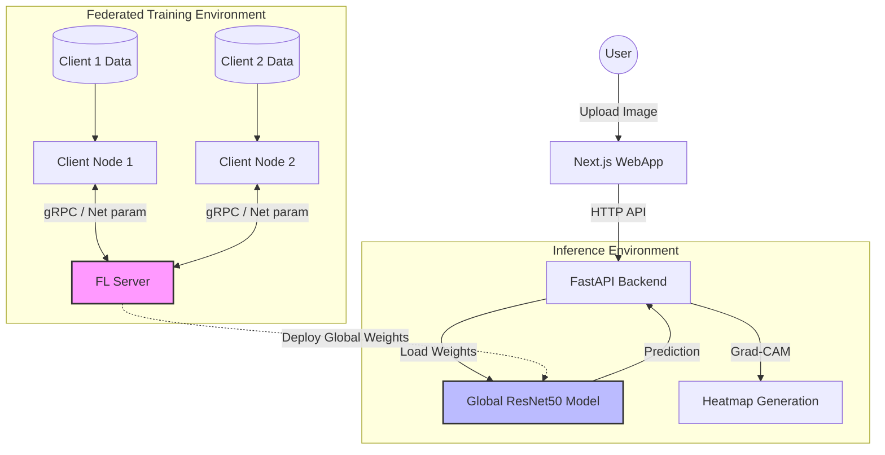

# 🛡️ Federated Deepfake Detection System


A privacy-preserving **Federated Learning system** designed to verify the authenticity of images and detect deepfakes generated by **StyleGAN**. This project leverages **ResNet50** as the backbone model, aggregating gradients from multiple clients to train a robust global model without ever sharing raw local data.

---

## 🏗️ System Architecture

The system follows a star topology where a central server orchestrates the training process across multiple distributed clients.



### Component Flow
1.  **Federated Learning**: The **Server** initializes the global model parameters. **Clients** download these parameters, train locally on their private datasets (StyleGAN vs Real), and send updated weights back to the server.
2.  **Aggregation**: The Server aggregates these updates (using FedAvg strategy) to improve the Global Model.
3.  **Deployment**: The updated Global Model is made available to the **Backend**.
4.  **Inference**: Users interact with the **WebApp** to upload suspicious images. The **Backend** processes the image using the Global Model and returns a probability score along with a Grad-CAM heatmap explaining the decision.

---

## ✨ Key Features

*   **🔒 Privacy-First**: Utilizes Federated Learning to ensure raw training data never leaves the client's device.
*   **🧠 Advanced Detection**: Fine-tuned **ResNet50** architecture optimized for detecting GAN-generated artifacts.
*   **🐳 Fully Containerized**: Dockerized microservices architecture for effortless deployment and scaling.
*   **👁️ Explainable AI**: Integrated **Grad-CAM** (Gradient-weighted Class Activation Mapping) to visualize which parts of the image influenced the model's decision.
*   **⚡ Modern Stack**: Built with **Python 3.9**, **PyTorch**, **FastAPI**, and **Next.js**.

---

## 🚀 Quick Start

This system is designed to be run with **Docker Compose**. For detailed deployment instructions, including port configurations and troubleshooting, please refer to the **[Deployment Guide](DOCKER.md)**.

### 1-Click Run
```bash
# Clone the repository
git clone https://github.com/yourusername/deepfake-stylegan-detection.git

# Build and start services
docker-compose up --build
```

Access the application at **[http://localhost:3000](http://localhost:3000)**.

---

## 📂 Project Structure

```bash
.
├── server/                 # 🧠 Federated Learning Server (Orchestrator)
├── client_machine/         # 💻 Federated Client Node (Local Training)
├── backend/                # 🚀 FastAPI Backend (Inference & API)
├── webapp/                 # 🌐 Next.js Frontend (User Interface)
├── src/                    # 📦 Shared Source Code (Models, Configs)
├── docker-compose.yml      # 🐳 Container Orchestration Config
├── README.md               # 📖 Project Documentation
└── DOCKER.md               # 🛠️ Deployment Guide
```

---

## 🛡️ Security

The system implements basic security measures for the federated environment:
*   **JWT Authentication**: Clients must authenticate with the server using a shared `SECRET_KEY`.
*   **Token Validation**: The server rejects updates from unauthorized clients.

To configure security, update the `SECRET_KEY` in your `.env` file.

---

## 📈 Monitoring

Training progress is logged to the console and saved in the `runs/` directory. You can monitor:
*   Global Model Accuracy/Loss per round.
*   Client connectivity statuses.
*   Aggregation latency.

---

## 🤝 Contributing

Contributions are welcome! Please follow these steps:
1.  Fork the repository.
2.  Create a feature branch (`git checkout -b feature/AmazingFeature`).
3.  Commit your changes (`git commit -m 'Add some AmazingFeature'`).
4.  Push to the branch (`git push origin feature/AmazingFeature`).
5.  Open a Pull Request.

---

## 📄 License

This project is licensed under the MIT License - see the [LICENSE](LICENSE) file for details.
